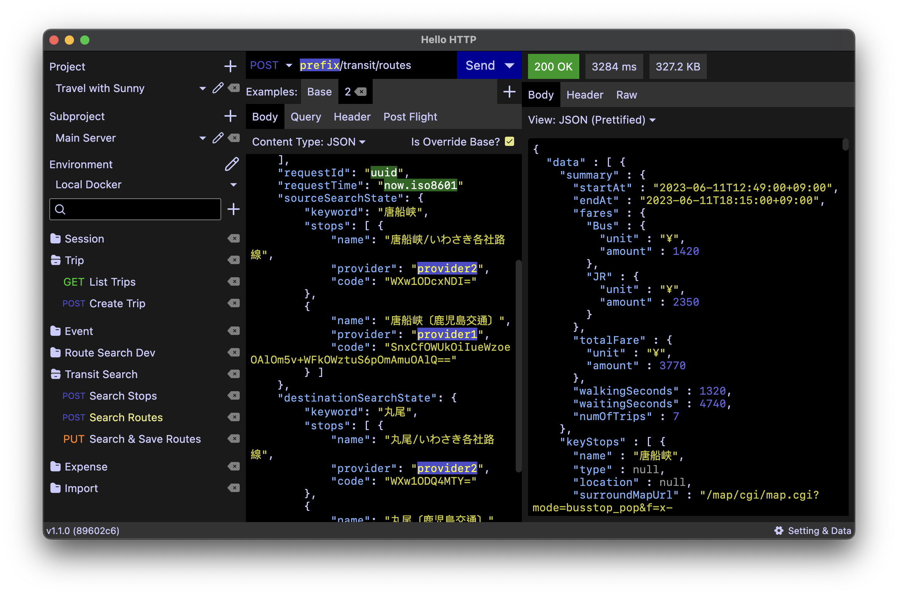

# Hello HTTP

[](LICENSE)

This is a cross-platform desktop application for testing HTTP API and WebSocket endpoints. This is an alternative to Postman, Insomnia REST, etc.




This was made because of the decision these software made to go cloud and some of their imperfects.

Though this was built to address my daily needs, hope this could also help solving many of your problems!
There is no plan to go a shared cloud, but it might be possible at a later stage to go online under clouds managed by
users themselves, for example, users' Dropbox, users' S3, or users' Git repository. That is a bit far at this
moment.

## Status

- **macOS** - Stable since v1.2.0
- **Windows** - Beta
- **Linux** - Alpha

## Features

**Data**
- **Only you own your data** - no mandatory online registration or request collection sharing
- Automatic local regular backup - no more frustrations due to misclicking delete buttons and mistakes
  - configurable backup retention period (default 15 days)
  - backup at every launch and every 6 hours while the application is running
  - you can make it online by e.g. mounting the backup directory to Dropbox or writing rsync scripts
- Data freedom - your data is not locked to one software
  - Import from
    - Insomnia
    - Postman
  - Export to
    - Insomnia
    - (make feature requests for more destinations)
- Selective exports

**Requests and Projects**
- Firing HTTP/1.1 and HTTP/2 requests
  - with HTTP methods:
    - GET
    - POST
    - PUT
    - DELETE
    - OPTIONS
    - HEAD
  - with request body varieties:
    - Form URL-encoded
    - Multipart Form with file upload
    - JSON
    - Raw String
    - Binary File
    - None
  - with query parameters and headers
- Connecting and sending payloads to WebSocket endpoints
- Request management with infinite nested folders
- Multiple examples (request templates) with 1-level inheritance for each request - handle different scenario of the same API in the same request entry
- Multiple payload examples for WebSocket requests
- Multiple subprojects per project, designed for multiple services use
- Multiple environments (no inheritance) per subproject, in which each one has
  - Environment variables that can be embedded anywhere in the request (type `${{variable-name}}`)
  - SSL configuration
  - HTTP protocol preference
- Functions that can be resolved anywhere in the request:
  - UUID (type `$((uuid))`)
  - Current date-time ISO-8601 string (type `$((now.iso8601))`)
- Copying as verbose cURL commands

**Response**
- JSON syntax highlighting
- Post flight actions
  - update environment variables according to a request field (JSON path) or header
- Transport I/O timeline view
  - DNS lookup, connection and SSL events
  - Raw HTTP/1.1 messages
  - HTTP/2 decoded frames with push promises
- Message stream logs for WebSocket communications
- Persistence per request example

**Appearance**
- Dark and light theme

**Others**
- Best effort to make executables portable. Installation is not mandatory.

## Executables are not signed by verified developers

Yes. I have no budget to obtain a developer license. If you are concerned,
you may grab the source code and build an executable on your own, or
make a sponsorship if you admire Hello HTTP.

To build an executable, grab the code, make sure there is a JDK 17+ and git installed, and run:
```shell
./gradlew createDistributable
```

## Persistence

All data are saved in a single content root directory. In Hello HTTP, open setting, scroll down and click
"Open Backup Directory", then go to one level upper. This is the content root directory.

Clearing this directory would reset the application.

## Planned

Following features are on the TODO list (not in order). Feel free to raise feature requests or
express your desired priorities in the issue tracker.

- GraphQL (except subscription)
- gRPC (via reflection)
- GraphQL subscription
- Custom HTTP methods
- Searching in response body
- Filtering JSON response body by JSON path
- Response JSON folding
- Export to Postman
- Duplicating requests
- Copy buttons in response
- Binary response view
- Binary request editor
- More SSL configuration
- Overriding default headers
- Example-level variables
- Checking for version updates
- Establish release builds (minified and without debug logs and symbols)
- Streamlining building executables for multiple OS

## Development

Hello HTTP heavily relies on [Jetpack Compose Multiplatform](https://www.jetbrains.com/lp/compose-multiplatform/).
There are quite a number of components built from scratch. Please file a request if you would like them to become a
reusable library.

This project can be edited by any code editor that supports Kotlin 1.8, though IntelliJ IDEA is recommended.
