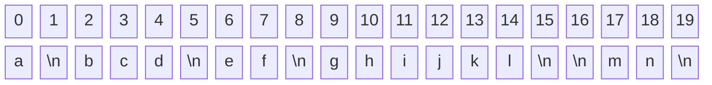
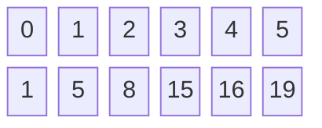
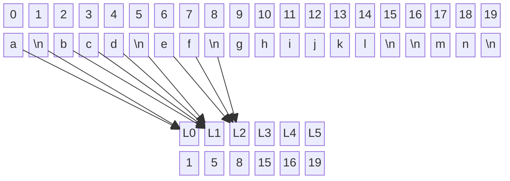

# Line Queries

## Find Line Index and Column Index

Example:

```mermaid
block-beta
    columns 20
    0 1 2 3 4 5 6 7 8 9 10 11 12 13 14 15 16 17 18 19
    a c1["#92;n"] b c d c5["#92;n"] e f c8["#92;n"] g h i j k l c15["#92;n"] c16["#92;n"] m n c19["#92;n"]
```

Line break indices are:

```mermaid
block-beta
    columns 6
    0 1 2 3 4 5
    l0["1"] l1["5"] 8 15 16 19
```

```mermaid
block-beta
    columns 20
    H0["0"] H1["1"] H2["2"] H3["3"] H4["4"] H5["5"] H6["6"] H7["7"] H8["8"] H9["9"] H10["10"] H11["11"] H12["12"] H13["13"] H14["14"] H15["15"] H16["16"] H17["17"] H18["18"] H19["19"]
    a c1["#92;n"] b c d c5["#92;n"] e f c8["#92;n"] g h i j k l c15["#92;n"] c16["#92;n"] m n c19["#92;n"]
    space:20
    space:20
    space:7 L0 L1 L2 L3 L4 L5 space:7
    space:7 l0["1"] l1["5"] 8 15 16 19
    
    a-->L0
    c1-->L0
    b-->L1
    c-->L1
    d-->L1
    c5-->L1
    e-->L2
    f-->L2
    c8-->L2
```
