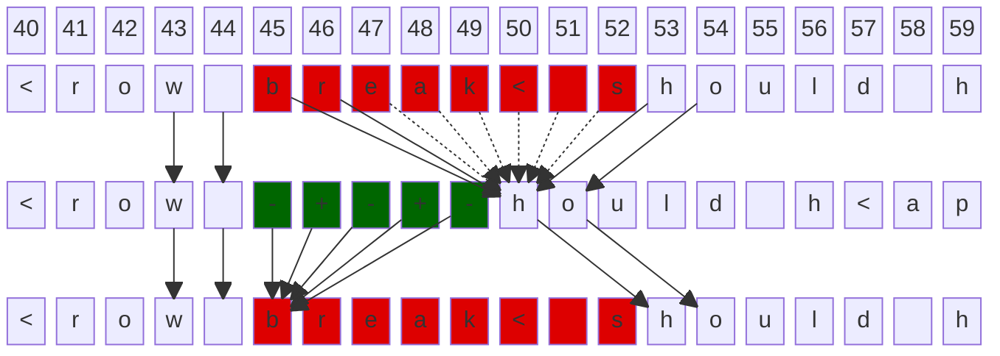
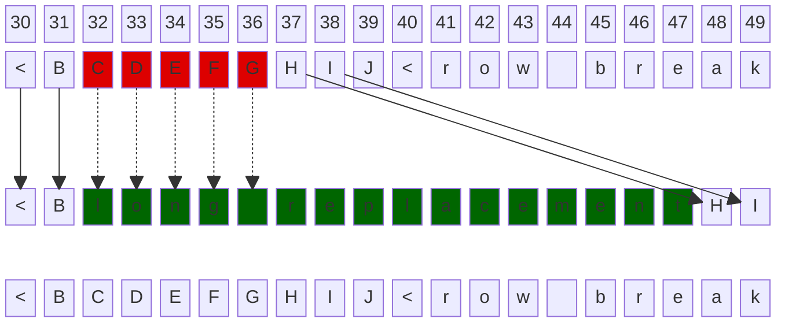

# Transform Replaces

## Block-offset transforms

- Transformed positions are never mapped from original positions
- New transform inserts to the same position of existing block-offset transforms would append the new text to the end of it

### `simpleBlockTransformReplaces` first test case

## Incremental-offset transforms

- Transformed positions are mapped 1-to-1 from original positions, until the earliest end of either one
- New transform inserts to the same position of existing incremental-offset transforms would append the new text to the start of it

### `mixedTransformReplaces` first test case

## Transform inserts

Transform inserts behaves the same as block-offset transform replaces without deletions.
